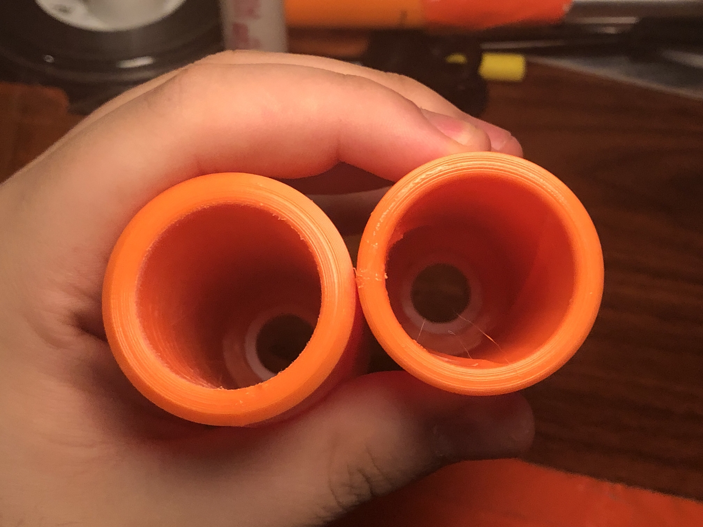

# Trivictus MegaXL Barrel
A barrel for MegaXL based on the Trivictus SCAR by Thanh. (Also some smooth barrels too for fun)

## Design Info

This is the MegaXL Trivictus barrel, based off the Trivictus SCAR design by Thanh (https://www.thingiverse.com/thing:4967719). It is a barrel that uses 3 spiral lands down the length of the barrel to spin MegaXL darts real good. 

### THIS BARREL SHOULD REALLY ONLY BE USED WITH HIGH POWERED AIR BLASTERS, LIKE 4Bs AND TITANS. IF YOU WANT A BARREL FOR A SPRINGER, USE THE SMOOTH BARRELS ALSO INCLUDED IN THIS LISTING.

There are 4 versions of the Trivictus barrel:
- A version that attaches to the end of a Schedule 40 / 1/2 inch PVC barrel

- A version that attaches to the end of a Schedule 40 / 3/4 inch PVC barrel

- A version that attaches to the end of a 16mm barrel (Such as 1/2in CPVC and metal barrels used for normal sized darts.)

- A blank version of the barrel for you to use in your own designs, whether that be in a harmonica clip, revolver cylinder, barrel attachment, SCAR attachment, or whatever else you come up with!

- Smooth bore barrel versions of each of these versions are also available. Versions of versions, version-ception!

## Print Info

This design needs no supports, but might need a brim depending on your printer. All STLs were exported in their print orientation.

The inside of the barrel should be sanded smooth before firing to remove any sharp edges or print artifacts.

Print time of around 3.5 hours @ 20% Gyroid, 2 wall, 70mm/s. 

Part volume: 40mm x 40mm x 121mm

## Development Talk

I figured I should mention the testing I did with MegaXL barrels, people might find it interesting.

I did some testing with multiple different barrels, with two blasters. One being a singled Titan at 10 pumps, the other being my SuperSledge, which is basically the air volume of a Talon Claw.

With the lower powered blaster, Armatus' Twisty barrel and my Twirly barrel both perform worse than a simple smooth barrel.
With the Titan, my barrel and Armatus' barrel perform slightly better than a smooth barrel, especially at longer range.

I was chatting with Thanh the night I did that testing, and he mentioned scaling up his Trivictus SCAR to MegaXL size as a barrel. I then made a barrel that is just that; a scaled up Trivictus with some rounded off corners and a barrel coupler on one end.

Unfortunately, the extra friction of the Trivictus barrel was too much for the SuperSledge or my TalonClaw to fire. But with the Titan, it doesn't only fire, but it is very much more accurate than a smooth barrel, especially at range!

TLDR: 

Twirly and Twisty barrel worse than smooth barrel at low power, slightly better than smooth barrel at high power.

New Trivictus MegaXL barrel way better than smooth barrel at high power, doesn't work at all at low power.

Use smooth barrels for springers, use Trivictus barrel for air tank blasters like 4B's and Titans.

## Misc.

STEP and F3D files have been provided, enjoy.

**If you are having issues with any of my designs, let me know on Discord (Sillybutts#5905) or Reddit (u/SillyTheGamer).**

**If you wish to print and sell this item, please contact me for licensing. I can be reached on Discord (Sillybutts#5905) or Reddit (u/SillyTheGamer). We will also need to discuss with Thanh. The smooth barrel versions are all CC0, go ham with those.**

- **If you want to support what I do, go buy stuff at my RedBubble! https://www.redbubble.com/people/Sillybutts/shop**

## Images

